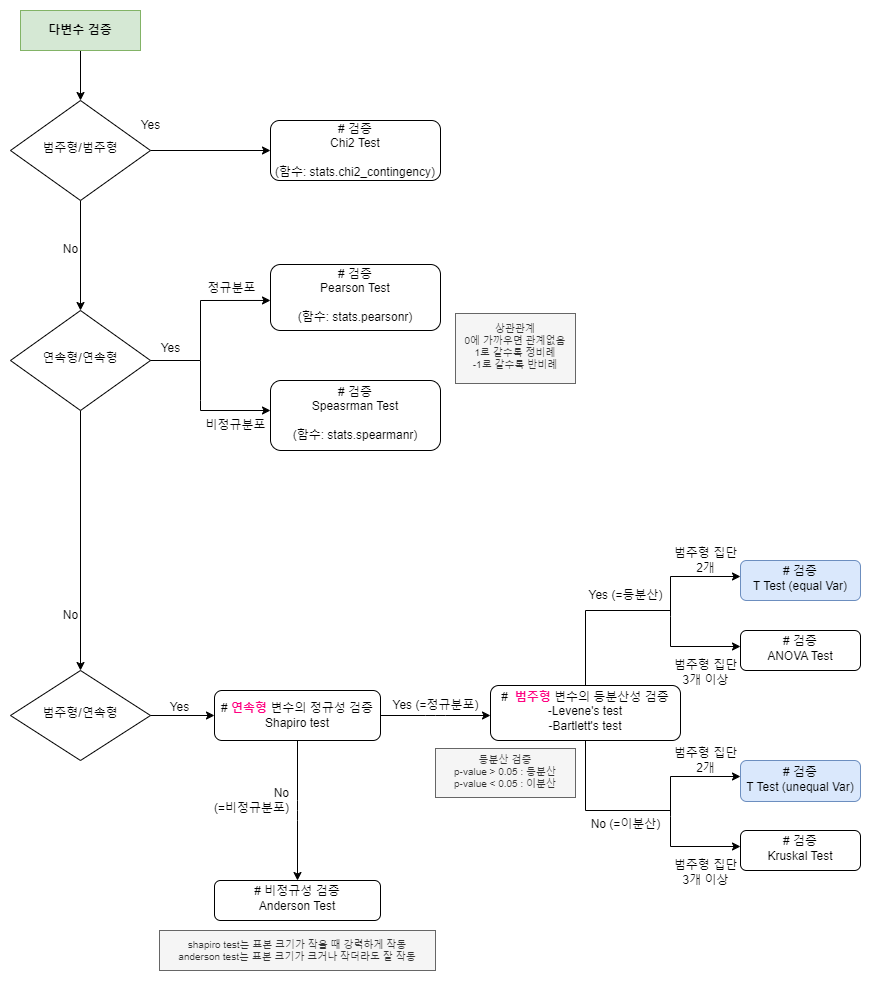

Titanic From Disaster(타이타닉 참사)

  #### DDA (기술통계분석)
| Variable | Definition | 분석가 의견 |
| --- | --- | --- |
| PassengerId | 승객 고유 식별 번호| 수치형-이산형, 레코드 개수와 동일하기 때문에 분석에는 적당하지 않음 |
| survived | 생존여부( 0 = No, 1 = Yes ) | 범주형-명목형, 죽거나 살거나 두가지로 분류됨 |
| Pclass | 선실 등급 ( 1 = 1st, 2 = 2nd, 3 = 3rd) | 범주형-순서형, 티켓이 3개의 등급으로 분류됨 |
| Name | 승객 이름 | 범주형-명목형, 확인 결과 승객이 고유한 이름을 가지고 있음 |
| Sex | 승객 성별 | 범주형-명목형, 확인 결과 male/female 두가지로 분류됨 |
| Age | 승객 나이 | 수치형-이산형 |
| Sibsp | 함께 탑승한 형제, 자매, 배우자의 수 | 수치형-이산형, 타이타닉에 동승한 형제/자매/배우자를 합친수로 각각 다른 값이 존재 |
| Parch | 함께 탑승한 부모, 자녀의 수 | 수치형-이산형, 타이타닉에 동승한 부모님과 자녀를 합친수로 각각 다른 값이 존재 |
| Ticket | 티켓 번호 | 범주형-명목형, 탑승객마다 다른 티켓 번호를 가지고 있음 |
| Fare | 지불한 운임 비용 | 수치형-이산형 |
| Cabin | 선실 번호 | 범주형-명목형 |
| Embarked | 탑승한 항구(C = Cherbourg, Q = Queenstown, S = Southampton) | 범주형-명목형 |

TypeOfContractChannel(계약 유형 채널)

#### DDA (기술통계분석)
| Variable | Definition | Key | 분석가 의견 |
| --- | --- | --- | --- |
| id | 아이디 | | 수치형-이산형, 레코드 개수와 동일하기 때문에 분석에는 적당하지 않음 |
| type_of_contract | 계약방식 | 렌탈, 멤버십 | 범주형-명목형, 2개의 카테고리로 분류되어 순서나 계량적 의마가 없음 |
| type_of_contract2 | 계약종류 | Promotion, Normal, TAS, ... | 범주형-명목형, 데이터 간 순서나 계량적 의미 없음 |
| channel | 채널 | 서비스 방문, 홈쇼핑/방송, 렌탈 재계약... | 범주형-명목형, 20개의 카테고리로 나누어지고 순서나 계량적 의미가 없음 |
| datetime | 계약 날짜 | | 범주형-순서형, 계약 날짜는 날짜 간에 순서는 있지만 날짜 간의 간격이 일정하지 않고 동일하지 않음 |
| Term | 계약 기간 | 60, 36, 12, 39 | 범주형-명목형, 4개의 카테고리로 분류됨 |
| payment_type | 결제방식 | CMS, 카드이체, 무통장, ... | 범주형-명목형, 5개의 카테고리로 순서 상관없이 나누어짐 |
| product | 제품 | K1, K2, K3, K4, ... | 범주형-명목형, 순서 상관없는 6개의 제품 카테고리로 분류됨 |
| amount | 제품 가격 | | 수치형-이산형, 정수 값을 가지고 있으며 제품마다 각기 다른 가격을 가지고 있음 |
| state | 상태 | 계약확정, 해약확정, 기간만료, ... | 범주형-명목형, 4개의 카테고리로 분류됨 |
| overdue_count | 연체횟수 | | 수치형-이산형, 연속적인 값 중 하나의 정수값으로 표현됨 |
| overdue | 연체 | 있음, 없음 | 범주형-명목형, 2개의 카테고리로 분류. 대부분 없음에 해당되어 분석에는 적당하지 않음 |
| credit rating | 신용등급 | 1, 2, 5, 8, ... | 범주형-순서형, 신용등급은 일정 범위 내에서 순서대로 구분됨 |
| bank | 은행 | 새마을금고, 현대카드, 우리은행, ... | 범주형-명목형 |
| cancellation | 취소 | 정상, 해약 | 범주형-명목형, 정상 혹은 해약 2개의 범주로 분류됨 |
| age | 나이 | | 수치형-연속형, 나이는 연속적인 숫자로 표현되며 정수 또는 소수점 형태로도 표현이 가능함 |
| Mileage | 마일리지 | | 수치형-이산형, amount에 따라 마일리지가 달라짐 |

<strong>다변수 검증 FlowChart</strong>

## 데이터 분석 공부
#### <사용기술>
       
### ✅Pandas
: 파이썬의 데이터 분석과 조작을 위한 라이브러리  
<판다스를 선택하는 이유>
- 데이터를 다루기 쉬운 두 가지 기본 데이터 구조인 Series와 DataFrame을 제공
- 특정 조건을 만족하는 데이터를 빠르게 추출하거나 원하는 방식으로 정렬
- 데이터를 효과적으로 통합하거나 연관된 정보를 결합하는 데 유용
- 데이터에서 누락된 값 또는 이상한 값들을 처리하고 정제하는 다양한 도구를 제공
- 다양한 통계 및 집계 함수를 제공
- 시각화 지원
- 유연성과 확장성 : 다양한 형태의 데이터를 처리할 수 있으며, 다른 라이브러리와 쉽게 통합

|설명|작성|
|---|---|
|데이터 확인|[BreastCancerWisconsinDataSet](https://github.com/aabchyein/study_data_analystics/blob/main/codes/pandass/BreastCancerWisconsinDataSet.ipynb)|
|데이터 구조(Data Frame, Series)|[begginners](https://github.com/aabchyein/study_data_analystics/blob/main/codes/pandass/begginners.ipynb)|
|날짜형데이터(datetime)|[DeliveryList_TimeSeries](https://github.com/aabchyein/study_data_analystics/blob/main/codes/pandass/DeliveryList_TimeSeries.ipynb)|
|전처리(결측치, 이상치)|[preprocess](https://github.com/aabchyein/study_data_analystics/blob/main/codes/pandass/preprocess.ipynb)|
|apply(),regexpress(정규식)|[begginners.py](https://github.com/aabchyein/study_data_analystics/blob/main/codes/pandass/begginners.py)|
|시각화 분석 접근 방식|[ResurrenceOfSurgery_TimeSeries](https://github.com/aabchyein/study_data_analystics/blob/main/codes/pandass/ResurrenceOfSurgery_TimeSeries.ipynb)|

### ✅ 데이터 수집 Gathering Datas
|차이점|MongoDB|MySQL|
|---|---|---|
|데이터 모델|-NoSQL 데이터베이스 -문서 형태로 데이터를 저장합니다. 문서는 JSON 스타일의 BSON(Binary JSON) 형태로 저장|-관계형 데이터베이스(RDBMS) -테이블 간의 관계를 기반으로 데이터를 저장|
|스키마|동적 스키마를 가지고 있어 어떤 문서든지 필요에 따라 다른 구조를 가질 수 있음|고정된 스키마를 가지고 있어 데이터 구조가 사전에 정의되어야 함|
|쿼리 언어|자체 쿼리 언어를 사용. 일반적으로는 JSON 형태로 쿼리를 작성|SQL(Structured Query Language)을 사용하여 쿼리|
|관계|중첩된 문서나 참조를 사용하여 데이터를 관리|테이블 간의 관계를 사용하여 데이터를 조인|
|확장성|수평 확장(Horizontal Scaling)이 일반적|수직 확장(Vertical Scaling)이 일반적|
|용도|대용량의 비정형 데이터나 유연한 데이터 모델이 필요한 경우, 빠른 개발과 스키마의 변동이 잦은 경우에 적합|전통적인 업무 애플리케이션, 관계형 데이터베이스가 필요한 경우에 적합|

- MySQL
: 판다스를 사용하여 SQL 연결하기 - [selectsWithpandas.py](https://github.com/aabchyein/study_data_analystics/blob/main/codes/gatheringdatas/mysql/selectsWithpandas.py)

- MongoDB

|설명|작성|
|---|---|
|MongoDB연결|[NSC2_D20](https://github.com/aabchyein/study_data_analystics/blob/main/codes/gatheringdatas/mongodb/NSC2_D20.ipynb)|
|MongoDB 명령어|[command.txt](https://github.com/aabchyein/study_data_analystics/blob/main/codes/gatheringdatas/mongodb/command.txt)|
|py으로 MongoDB 업데이트|[updates.py](https://github.com/aabchyein/study_data_analystics/blob/main/codes/gatheringdatas/mongodb/updates.py)|
|pandas로 MongoDB 업데이트|[updatewithpandas](https://github.com/aabchyein/study_data_analystics/blob/main/codes/gatheringdatas/mongodb/updatewithpandas.ipynb)|

- Seleniums
: 웹 페이지 자동화 및 테스트를 위한 프레임워크로, 브라우저를 제어하여 웹 애플리케이션을 자동으로 테스트하거나 데이터를 수집하는 데 사용
: 이는 웹 크롤링과 웹 스크래핑 작업에서 유용하게 활용됩니다. 크롤링은 웹 페이지의 데이터를 수집하고, 스크래핑은 수집한 데이터에서 필요한 정보를 추출하는 작업을 의미

|설명|작성|
|---|---|
|브라우저 열고 닫기, 스크린샷|[begginers](https://github.com/aabchyein/study_data_analystics/blob/main/codes/gatheringdatas/seleniums/begginers.ipynb)|
|하나 혹은 여러 개의 element 가져오기, list|[emartmalls_FindElement](https://github.com/aabchyein/study_data_analystics/blob/main/codes/gatheringdatas/seleniums/emartmalls_FindElement.ipynb)|
|pagination|[emartmalls_paginations](https://github.com/aabchyein/study_data_analystics/blob/main/codes/gatheringdatas/seleniums/emartmalls_paginations.ipynb)|
|로그인|[github_events_except](https://github.com/aabchyein/study_data_analystics/blob/main/codes/gatheringdatas/seleniums/github_events_except.ipynb)|
|loops|[googlestore_healthcare_loops](https://github.com/aabchyein/study_data_analystics/blob/main/codes/gatheringdatas/seleniums/googlestore_healthcare_loops.ipynb)|
|loops_for|[googlestore_healthcare_loops_complete](https://github.com/aabchyein/study_data_analystics/blob/main/codes/gatheringdatas/seleniums/googlestore_healthcare_loops_complete.ipynb)|
|추가 댓글 가져오기(클릭 or 마우스 스크롤)|[googlestore_healthcare_single](https://github.com/aabchyein/study_data_analystics/blob/main/codes/gatheringdatas/seleniums/googlestore_healthcare_single.ipynb)|

### ✅ 자연어 처리(Natural Language Processing)
: 기계가 인간의 언어를 이해하고 처리하는 인공지능 분야. 자연어로 표현된 정보를 컴퓨터가 처리하고 분석하는 기술
- LDA는 토픽 모델링의 한 종류로, 문서 집합에서 주제를 추출하는 알고리즘입니다. 주어진 문서에서 단어들이 특정 주제에 속할 확률을 계산하여 각 문서의 주제 구조를 파악

|설명|작성|
|---|---|
|불용어 처리|[tokenizers](https://github.com/aabchyein/study_data_analystics/blob/main/codes/NLP/tokenizers.ipynb)|
|gensim을 통해 LDA|[LDA_gensim](https://github.com/aabchyein/study_data_analystics/blob/main/codes/NLP/LDA_gensim.ipynb)|
|sklearn을 통해 LDA|[LDA_sklearn](https://github.com/aabchyein/study_data_analystics/blob/main/codes/NLP/LDA_sklearn.ipynb)|
|sklearn을 통해 LDA|[LDA_sklearn](https://github.com/aabchyein/study_data_analystics/blob/main/codes/NLP/LDA_sklearn.ipynb)|
|sklearn을 통해 LDA|[LDA_sklearn](https://github.com/aabchyein/study_data_analystics/blob/main/codes/NLP/LDA_sklearn.ipynb)|
|sklearn을 통해 LDA|[LDA_sklearn](https://github.com/aabchyein/study_data_analystics/blob/main/codes/NLP/LDA_sklearn.ipynb)|
|sklearn을 통해 LDA|[LDA_sklearn](https://github.com/aabchyein/study_data_analystics/blob/main/codes/NLP/LDA_sklearn.ipynb)|
|sklearn을 통해 LDA|[LDA_sklearn](https://github.com/aabchyein/study_data_analystics/blob/main/codes/NLP/LDA_sklearn.ipynb)|
|sklearn을 통해 LDA|[LDA_sklearn](https://github.com/aabchyein/study_data_analystics/blob/main/codes/NLP/LDA_sklearn.ipynb)|

### ✅ 감성분석(Sentiment Analysis)
: 텍스트 데이터에서 긍정 또는 부정의 감정을 자동으로 분석하여 판별하는 자연어 처리 기술
- 퀘스트 : [PDF](https://docs.google.com/presentation/d/1BfNmgq14D24HLPPGolin2gt4Hoos6WTu9MNxdGrjw6Q/edit?usp=sharing), [작성소스](https://github.com/aabchyein/study_data_analystics/blob/main/codes/NLP/navermovierating_mechinelearning_quest.ipynb)

|설명|작성|
|---|---|
|감성 사전에 의한 감성분석|[sentiment_analyze_dictionary](https://github.com/aabchyein/study_data_analystics/blob/main/codes/NLP/sentiment_analyze_dictionary.ipynb)|
|머신러닝에 의한 감성분|[sentiment_analyze_machinelearning](https://github.com/aabchyein/study_data_analystics/blob/main/codes/NLP/sentiment_analyze_machinelearning.ipynb)|

### ✅시각화 visuallizations
|설명|작성|
|---|---|
|시각화 기초|[simples](https://github.com/aabchyein/study_data_analystics/blob/main/codes/visuallizations/simples.ipynb)|
|scatter plot(산점도)-두 변수간의 관계를 시각화|[classfications_scatter](https://github.com/aabchyein/study_data_analystics/blob/main/codes/visuallizations/classfications_scatter.ipynb)|
|상위권 데이터 확인|[UsingCharts_TypeOfContractChannels_quests](https://github.com/aabchyein/study_data_analystics/blob/main/codes/visuallizations/UsingCharts_TypeOfContractChannels_quests.ipynb)|
|단일변수,다변수 시각|[UsingCharts_TypeOfContractChannels](https://github.com/aabchyein/study_data_analystics/blob/main/codes/visuallizations/UsingCharts_TypeOfContractChannels.ipynb)|

